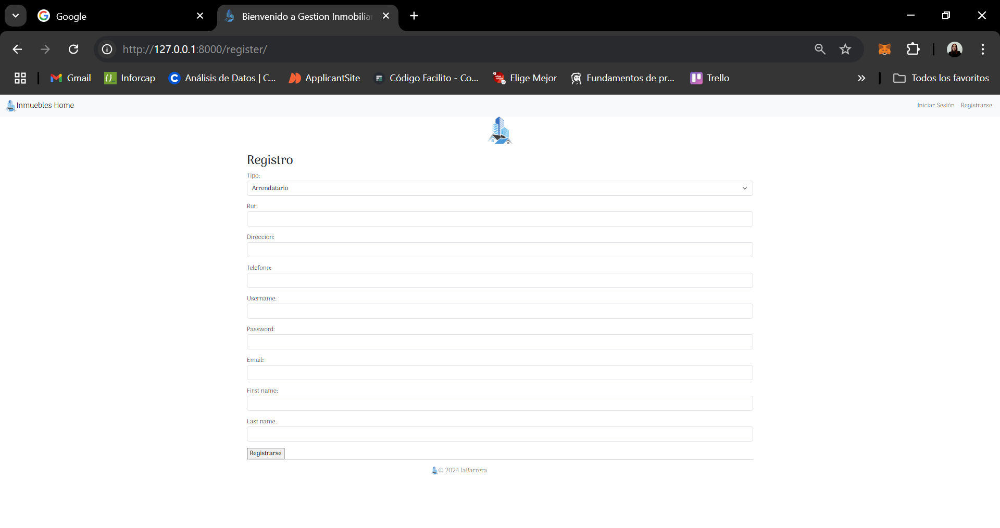
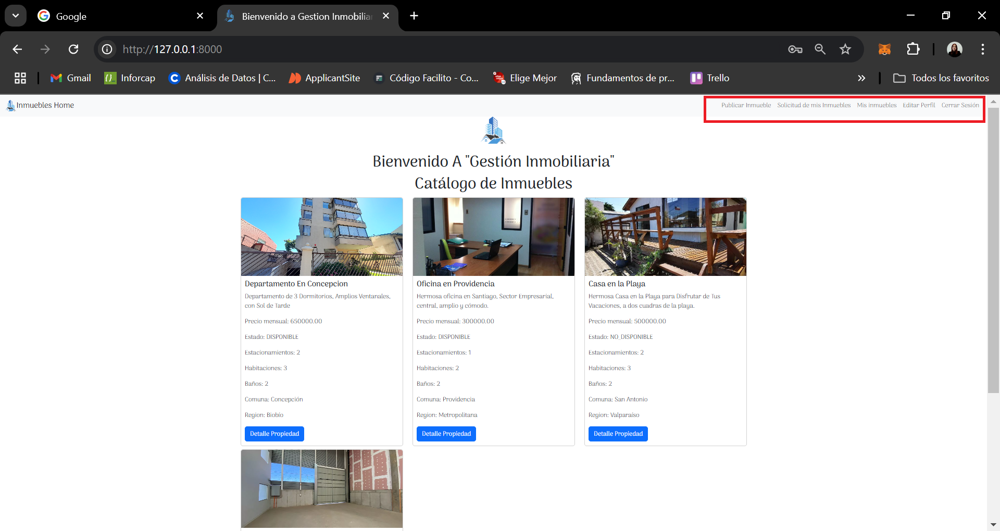

# Titulo del proyecto

Aplicación Gestion Inmobiliaria

## Descripción del proyecto

Prueba Modulo 7 Fullstack Python 2024, G19. Se solicita crear aplicacion para gestionar arriendo de Inmuebles,con usuarios del tipo arrendador, y arrendatario. El arrendador, puede solicitar el arriendo de un inmueble. El arrendatario, puede ingresar inmuebles, editar su estado, ver las solicitudes de arriendo, eliminar inmuebles.
Ambos usuarios pueden editar su perfil.

## Prerequisitos o Dependencias

Lista de software y herramientas utilizadas.

- Sistema Operativo -  Windows 10
- Lenguaje de programación - Python 3.12.4
- Framework Django
- Base de datos - PostgreSQL 16
- Css
- Bootstrap
- Google fonts
- JavaScript (para filtros de Region y Comunas)

## Instalación del Proyecto

En la terminal:
1. -"python -m venv .venv"
2. - "source .venv/Scripts/activate
(.venv) --(Utilizo Windows)."

3. - "pip install django psycopg2"

4. - "pip freeze > requirements.txt" , para guardar las dependencias de nuestro proyecto.

5. - "django-admin startproject proyecto_inmuebles"

6. -  "cd proyecto inmuebles" --> ingresamos al directorio del proyecto para poder trabajar

7. - En DBeaver creamos la Base de datos, para poder Cargar los datos de Nuestro Proyecto.

8. - En settings.py de nuestro Proyecto, ingresamos los datos de nuestra base, en mi caso se utilizo un entorno virtual .venv para proteger los accesos ya que al conectarme via .env con los datos de mi base me genera problemas, al menos en mi computador.

9. - Creamos las migracion inicial, con "python manage.py migrate", corroboramos que nuestro proyecto este conectado a nuestra base de datos.

10. - Luego creamos la app para nuestro Proyecto: Con "python manage.py startapp gestion_inmuebles" y la agregamos a nuestras app en settings.py.

## Instrucciones para Cargar la Base de Datos o Migrar los Modelos

11. - Dentro de nuestra app, gestion_inmuebles trabajamos los modelos en el archivo models.py

12. - Realizamos las Migraciones de nuestros modelos a la base de datos para que se creen las tablas correspondientes con el comando "python manage.py makemigrations", luego  "python manage.py migrate"

13. - Con los modelos relizados  creamos nuestro super user con "python manage.py createsuperuser".

14. - Posteriormente, en nuestro archivo admin.py, configuramos los modelos para usar con el Admin de django para el manejo de datos con nuestra base.

    - Revisamos haciendo correr el servidor con "python manage.py runserver", ingresamos con las credencial del super user y vemos el panel admin de Django.

## Instrucciones para Cargar los Datos Semilla a la Base de Datos

#Comandos necesario para cargar los datos semilla a la base de datos.

15. - Para poder cargar Datos Semilla Primero creare regiones En el Directorio de nuestra app, con el admin de Django.
- Luego desde el directorio  cargaremos datos semilla a nuestra base de datos mediante achivos json con loaddata. "python manage.py regiones.json"

- Luego las comunas "python manage.py loaddata comunas.json"

## Instrucciones para Ejecutar el Proyecto``

 - python maneges.py runserver.

 Ingresamos a la url que aparece en el Terminal donde tenemos la pagina de inicio. 

## Credenciales de Acceso

- Super Usuario del proyecto 
user: user
password: admin123*
email: admin@gestioninmobiliaria.cl

### Para Usuario Tipo Arrendatario

- Usuario: arrendatario1
- Contraseña: casa123*

### Para Usuario Tipo Arrendador

- Usuario: arrendador1
- Contraseña: test123*

### Vistas de las Paginas
## Capturas de Pantalla del Proyecto
1. - Pagina de inicio:

-  En esta Pagina, cualquiera que ingrese puede ver los inmuebles almacenados, y ver su detalle, pero no puede solicitarlos o editarlos.

2. - Vista Registro de Usuario: 

 - En Esta Seccion podemos registrar nuestra cuenta de user,elegir el tipo de Usuario y sus datos, una vez registrado exitosamente, redirige de forma automática a pagina de Inicio de Sesión.

3. -Vista Iniciar Sesion

4. - Modo Arrendador: 

 - El Usuario arrendador tiene una vista similar a la de todos los usuarios.En el Nav bar aparecen las funcionalidades diponibles para este tipo de Usuario, que son
    Publicar Inmueble: Donde puede agregar un inmueble a la pagina para arrendarlo a un Usuario del tipo Arrendatario.Mediante un Formulario.
    
    En esta vista se uso JavaSript, para poder filtar correctamente, por region, y luego por la comunas ligadas a esa region.

    Solicitud de mis Inmuebles: Donde Puede ver las solicitudes de arriendo de sus inmuebles. Los datos de los formularios de solicitud, se almacenan sin inconvenientes en la base de datos. (Funcionalidad no Implementada, pero su vista si.)
    

    Mis inmuebles: Donde puede ver los inmuebles que ha publicado, aca al seleccionar un inmueble, puede editarlo, eliminarlo.
    
        Sub_vista: Editar Inmuebles:
            

    Editar Perfil: Donde puede Editar sus datos, y tipo de usuario.
   

   

5. -  Vista Usuario Arrendatario:
    - Este tipo de usuario, puede ver los inmuebles disponibles, y no disponibles (publicados por usuarios, tipo Arrendador), pero solo puede solicitar para arrendar los inmuebles DISPONIBLES.(Misma vista de Inicio para todos los usuarios, los cambios segun perfil se ven principalmente en el Navbar y en las funcionalidades disponibles)
    En el home, ve la lista de Los inmuebles publicados, y al hacer click en el boton detalle, accede a la informacion completa del inmueble, la cual le da la opcion de volver al listado o solicitar el inmueble, solo si este esta en estado DISPONIBLE:

    
        Sub Vista Solicitud_Inmueble: Aca se despliega un Formulario, en el cual enviamos un mensaje al Usuario Arrendador, para solicitar en arriendo el inmuble Disponible. Los datos de este formulario se agregan sin problemas en la base de datos.

    Si el Inmueble esta en estado NO_DISPONIBLE, solo Puede ver el Detalle de Este, pero no Solicitarlo.
     
       
    El navBar para este tipo de Usuario, tiene las siguientes vistas: 

    Mis Solicitudes: Vista no disponible su funcionalidad(no era requerimiento del desafio.), pero si su vista html.
    

    Editar Perfil: Misma vista que para usuario tipo Arrendador:
    

7. - Vista Cierre de Sesión:

- La vista de Cierre de Sesion Exitosa, nos muestra un mensaje, y un enlace a la página de Inicio

    [Home](capturas_pantalla/vista_cerrar_sesion.png)

### Comentarios

- En lo personal este proyecto presento un gran desafio para mí, ya que me costo mucho hacer lograr unir el auth user con el perfil, lo que se logró finalmente usando la class UserProfileInline(admin.StackedInline) y la class CustomUserAdmin(UserAdmin).Lo cual me permitio un mejor manejo del registro de usuarios y su perfil en el código y facilitó el desarrollo del resto del proyecto.
- En cuanto a las funcionalidades, fue extenso ya que cada tipo de usuario necesitaba vistas y funciones distintas, y eso llevarlo a las views y urls me costo un poco.

- Finalmente, se logro hacer funcionar las solicitudes del desafío, con varios cambios en los modelos con respecto al hito 3, pero que fueron necesarios para que todo funcionara de la mejor forma posible.

- Creo que este proyecto me permitió aplicar todos lo conocimientos adquiridos a lo largo del Bootcamp y solucionar problemas que fueron saliendo en el camino. Con respecto a todo lo que es Base de datos, no tuve mayores inconvenientes con conectar mi proyecto y que guardara, eliminara y actualizara toda la informacion requerida en ellas.

## Autor

- [Camila Barrera Sandoval ](https://github.com/lacamibarrera/)

